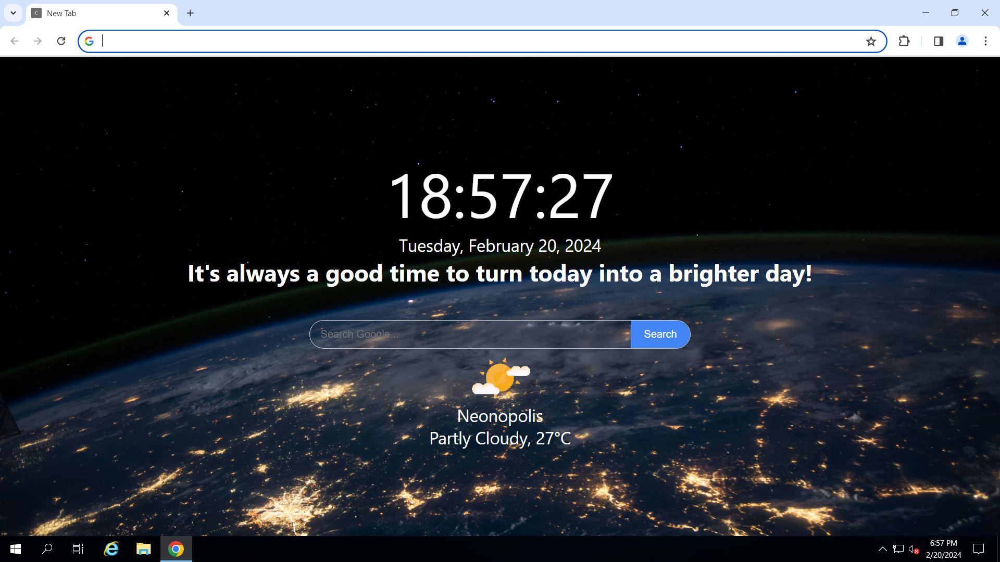

# new-tab-chrome-extension
A Chrome extension that will customize the look and functionality of each new tab you open in Chrome.

## Local Installation

1. Launch Google Chrome and access the menu represented by three dots located in the browser's upper-right corner.
2. Navigate to "More tools" > "Extensions."
3. Activate "Developer mode" by flipping the switch situated in the top-right corner of the page.
4. Select the "Load unpacked" button, choose the directory containing your unpacked extension, and then click on "Select Folder."

## Credits

- The images and media used in this project were sourced from:

    Background image: Photo by <a href="https://unsplash.com/@nasa?utm_content=creditCopyText&utm_medium=referral&utm_source=unsplash">NASA</a> on <a href="https://unsplash.com/photos/photo-of-outer-space-Q1p7bh3SHj8?utm_content=creditCopyText&utm_medium=referral&utm_source=unsplash">Unsplash</a>

    Weather icon lottie: [Partly cloudy](https://lottiefiles.com/animations/partly-cloudy-t7bXupGBbC) by Susana Alvarez on [LottieFiles](https://lottiefiles.com/)
